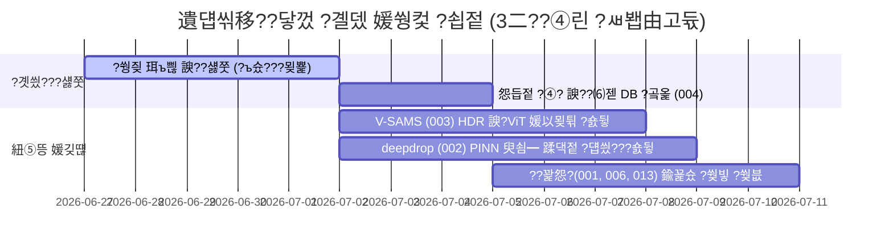

# 260626_2145_遺덉씪移??닿껐_?붾（??諛?媛쒕컻_?꾨왂_?섎┰_蹂닿퀬??
## ?묒꽦?? 2026-06-26 21:45
## ?묒꽦?? ?덊쁽李?(Hyunchan An)

---

### 1. 媛쒖슂

?듯빀 E2E 寃€利?蹂닿퀬??260626_2143_Corporate_E2E_Validation_Report.md) 遺꾩꽍 寃곌낵, ?쒖뒪???꾩뾽 ?꾩엯 ??諛섎뱶???닿껐?댁빞 ????媛€吏€ ?듭떖 遺덉씪移?Inconsistency) ?꾩긽??洹쒕챸?섏뿀?듬땲??
- 1. 鍮꾩쟾 湲곕컲 ?쒕㈃ 留덇컧 ?먮퀎 ??BA ?쇰땲?쒕? Mirror(No.8)濡??ㅻ텇瑜섑븯???꾩긽 (003 紐⑤뱢)
- 2. Hairline(HL) ?대갑???쒕㈃?먯꽌 ?쒕㈃ ?먯쑀 ?먮꼫吏€(SFE) 怨꾩궛媛믪씠 臾명뿄媛??€鍮???3.4 mN/m ??쾶 ?곗텧?섎뒗 ?쒓끝 ?꾩긽 (002 紐⑤뱢)
- 3. ??꽕怨??덉륫 紐⑤끂癒?諛고빀 怨듭떇怨??ㅼ젣 ?묒궛 ?쒗뭹 ?덉떆??媛꾩쓽 1 wt% ~ 5 wt% 誘몄꽭 ?몄감 諛쒖깮 ?꾩긽 (001, 006, 013 紐⑤뱢)

蹂?蹂닿퀬?쒕뒗 ?대? ?닿껐?섍린 ?꾪빐 ?ъ슜?먯쓽 異붽? ?쒕즺 ?ъ쭊 珥ъ쁺 ?붽굔怨?媛?紐⑤뱢蹂?AI ?뚭퀬由ъ쬁 媛쒖꽑 諛?媛€以묒튂 ?ы븰??Fine-tuning)???ш큵?섎뒗 援ъ껜?곸씤 ?붿??덉뼱留??꾨왂???쒖떆?⑸땲??

---

### 2. 鍮꾩쟾 ?쒕㈃ 留덇컧 ?ㅻ텇瑜??닿껐 ?꾨왂 (BA vs Mirror)

#### 2.1. 遺덉씪移??먯씤 ?붿빟
BA 留덇컧?€ 怨좎삩 ?섏냼 遺꾩쐞湲??뚮몦???듯빐 議곕룄媛€ ??퀬 ?됲솢?꾧? ?믪븘 愿묓깮?꾧? 500 GU瑜?珥덇낵?⑸땲?? ?대줈 ?명빐 鍮꾩쟾 梨붾쾭??愿묐웾??媛뺥븷 寃쎌슦 ?쇱꽌 ?ы솕(Saturation) ?몄씠利덉? ?쒕컲?ш? ?좊컻?섏뼱, ?띿뒪泥?異붿텧 紐⑤뱢???대? 臾쇰━?곸쑝濡????믪? ?깃툒??Mirror(Super Mirror, No.8) 留덇컧?쇰줈 ?ㅼ씤?앺븯寃??⑸땲??

#### 2.2. ?ъ슜??異붽? ?ъ쭊 珥ъ쁺 媛€?대뱶?쇱씤
臾쇰━?곸씤 諛섏궗愿??⑦꽩??誘몄꽭 李⑥씠瑜??숈뒿?쒗궎湲??꾪빐 ?ㅼ쓬 議곌굔???쒕즺 ?대?吏€ 異붽? ?뺣낫媛€ ?붽뎄?⑸땲??
- ?쒕즺 ?섎웾: ?ㅼ뼇???뺤뿰 ?앹궛 濡?듃(Lot) 諛?湲곗옱 ?먭퍡蹂?BA 媛뺥뙋 ?쒕즺 200???댁긽, Mirror 媛뺥뙋 ?쒕즺 200???댁긽 異붽? 珥ъ쁺.
- ?ㅻ떒怨?愿묐웾 諛??몄텧 ?쒖뼱(Bracketing) 珥ъ쁺:
  ?숈씪???쒕㈃???€??移대찓?쇱쓽 ?몄텧 ?쒓컙(Exposure)??5?④퀎(Under-exposed遺€??Over-exposed源뚯?)濡?議곗젅?섏뿬 ?쎌? ?ы솕瑜?諛⑹???怨좊떎?대굹誘??덉씤吏€(HDR) ?곗씠?곗뀑??援ъ텞?⑸땲??
- ?숈텞 議곕챸 媛곷룄 媛€蹂€ 珥ъ쁺:
  議곕챸 媛곷룄瑜??섏쭅(0??, ?ш컖(15?? 45?? 75???쇰줈 ?ㅺ컖?뷀븯??BA ?뱀쑀??洹밸???濡?留덊겕(Roll mark) ?붿쟻怨?Mirror??嫄곗슱硫?媛꾩쓽 ?낆궗媛곷퀎 ?섎룄 遺꾪룷 李⑥씠瑜??ъ갑?⑸땲??

#### 2.3. AI 媛€以묒튂 紐⑤뜽 ?ы븰??怨꾪쉷
- ?낅젰 ?대?吏€ ?꾩쿂由??뚯씠?꾨씪??媛쒖꽕:
  V-SAMS(003) ?꾩쿂由??④퀎???곸쓳???덉뒪?좉렇???됲깂??CLAHE) 諛??쇳뵆?쇱떆???꾪꽣瑜??곸슜?섏뿬, ?대?吏€??諛앷린 ?ы솕 ?곸뿭??寃⑸━?섍퀬 誘몄꽭 諛섏궗 ?ㅻ（?ｌ쓽 ?€鍮?Contrast)瑜?媛뺤젣濡?利앺룺?⑸땲??
- CNN 諛?Vision Transformer(ViT) 諛깅낯 媛€以묒튂 媛깆떊:
  異붽? ?뺣낫??釉뚮옒耳€???대?吏€?뗭쓣 湲곕컲?쇰줈 ResNet ?먮뒗 Swin Transformer 諛깅낯 遺꾨쪟湲곗쓽 媛€以묒튂 ?뚯씤?쒕떇???ㅼ떆?⑸땲?? ?뱁엳 BA?€ Mirror??寃쎄퀎硫??띿뒪泥??먯떎?⑥닔??Center Loss瑜?異붽? 寃고빀?섏뿬 ???대옒??媛꾩쓽 ?쇱쿂 怨듦컙(Feature space) 嫄곕━瑜?洹밸??뷀빀?덈떎.

---

### 3. Hairline(HL) ?쒕㈃ SFE 痢≪젙 ?쒓끝 ?닿껐 ?꾨왂

#### 3.1. 遺덉씪移??먯씤 ?붿빟
HL 留덇컧?€ ?곕쭏 踰⑦듃 ?먭뎅?쇰줈 ?명빐 ?쒕㈃??媛뺥븳 諛⑺뼢??梨꾨꼸(怨????뺤꽦?섏뼱 ?덉뒿?덈떎. ?대줈 ?명빐 ?≪쟻 遺꾩궗 ??寃?諛⑺뼢(?됲뻾)?쇰줈???듭쑄?깆씠 珥됱쭊?섍퀬 寃??섏쭅 諛⑺뼢?쇰줈???묒큺??嫄몃┝(Contact Line Pinning)??諛쒖깮?섏뿬 臾쇰갑???뺤긽???€?먰삎?쇰줈 蹂€?뺣릺硫? Wenzel 諛?Cassie-Baxter 臾쇰━???섑빐 寃됰낫湲??묒큺媛곸씠 ?쒓끝?⑸땲?? 2D 鍮꾩쟾?€ ?대? ?낆껜?곸쑝濡?蹂댁젙?섏? 紐삵빐 SFE ?ㅼ감瑜??낅땲??

#### 3.2. ?ъ슜??異붽? ?ъ쭊 珥ъ쁺 媛€?대뱶?쇱씤
?≪쟻??3李⑥썝 ?대갑??蹂€?뺣쪧??怨꾩궛?섍린 ?꾪빐 ?ㅺ컖??酉??대?吏€ 援ъ텞???꾩슂?⑸땲??
- ?ㅻ갑??珥ъ쁺??
  ?쒕즺?€??媛뺥뙋??嫄곗튂???곹깭?먯꽌 HL ?곕쭏 寃?諛⑺뼢??湲곗? ?쇱븘 ?뚯쟾 媛곷룄(0?? 45?? 90??蹂꾨줈 ?≪쟻 ?묒큺媛??ъ쭊??珥ъ쁺?⑸땲?? ?쒕즺??理쒖냼 3諛⑺뼢 x 50???댁긽???묒큺媛?痢≪젙???섑뻾?⑸땲??
- 議곕룄(Ra) 留ㅼ묶 ?곗씠?곗뀑 ?뺣낫:
  議곕룄怨꾨줈 ?ъ쟾??Ra(0.1 ~ 0.5 um 踰붿쐞)瑜??ㅼ륫??HL 媛뺥뙋 ?쒕즺?ㅼ뿉 ?€??媛곴컖 臾쇨낵 湲€由ъ꽭濡ㅼ쓽 ?묒큺媛?珥ъ쁺???섑뻾?섏뿬 ?쎌???臾쇰━???ㅼ??쇱쓣 ?쒓퉭?⑸땲??

#### 3.3. 臾쇰━ ?뺣낫 湲곕컲 蹂댁젙 ?섏떇 諛?AI ?숈뒿 ?곸슜
- Wenzel 議곕룄 ?몄옄(Roughness Factor, r) ?곗텧 ?뚭퀬由ъ쬁 ?꾩엯:
  007 3D 蹂듭썝 紐⑤뱢(SG-TERRA)?먯꽌 ?꾩텧???곕쭏 怨⑥쓽 ?ㅼ륫 源딆씠?€ 議곕룄(Ra) ?곗씠?곕? 002 紐⑤뱢濡??꾨떖?⑸땲??
- PINN(Physics-Informed Neural Network) 媛€以묒튂 紐⑤뜽 媛쒕컻:
  OWRK 怨듭떇??洹몃?濡??곸슜?섍린 ?꾩뿉, ?됲뻾 ?묒큺媛곴낵 ?섏쭅 ?묒큺媛곸쓽 湲고븯?됯퇏??痍⑦븯怨?Wenzel 諛⑹젙??cos_theta_apparent = r * cos_theta_true)???대윺 ?ㅽ듃?뚰겕???쒖빟 議곌굔(Loss Penalty)?쇰줈 ?쒖슜?섏뿬 寃됰낫湲??묒큺媛곸쑝濡쒕????ㅼ젣 ?댁뿭?숈쟻 ?됲삎 ?묒큺媛곸쓣 ??궛?섎뒗 蹂댁젙 ?덉씠??媛€以묒튂瑜??숈뒿?쒗궢?덈떎.

---

### 4. ??꽕怨?紐⑤끂癒?援ъ꽦鍮?遺덉씪移??닿껐 ?꾨왂 (?묒궛 怨듭젙 理쒖쟻??

#### 4.1. 遺덉씪移??먯씤 ?붿빟
AI ??꽕怨?紐⑤뜽(001, 006)?€ ?쒖닔 踰뚰겕 臾쇱꽦(?좊━?꾩씠?⑤룄, ?묐젰 ?꾪솕 ?띾룄)???뺣젹?섎뒗 ?댁뿭?숈쟻 理쒖쟻媛믩쭔???덉륫?⑸땲?? 諛섎㈃, ?묒궛 ?꾩옣??泥섎갑?€ 以묓빀 由ъ븸?곗쓽 寃뷀솕 諛⑹?(AA ?쒖빟), ?먯옄??議곕떖 鍮꾩슜 ?④?(2-EHA vs BA), ?⑹젣 諛?遺꾩옄???쒖뼱??媛€援먯젣 留덉쭊???곸슜?섏뼱 誘몄꽭 ?몄감媛€ ?앷퉩?덈떎.

#### 4.2. 異붽? ?곗씠?곕쿋?댁뒪(004) 蹂댁셿 ?꾨왂
- ?묒궛 ?곗씠???쇱쿂 ?뺤옣:
  004 DB???곸옱??以묓빀 泥섎갑 ?곗씠?곗뿉 紐⑤끂癒?鍮꾩쑉 ?몄뿉 ?⑹젣 鍮꾩쑉(wt%), 怨좏삎遺??⑤웾(%), 媛€援먯젣 泥④???phr), 媛쒖떆??醫낅쪟, 洹몃━怨?紐⑤끂癒몃퀎 ?ㅼ떆媛?援щℓ ?④? 吏€??Commercial Cost Index)瑜??쇱쿂(Feature)濡?異붽? ?곸옱?⑸땲??

#### 4.3. 013 ??꽕怨?寃뚯씠?몄썾??理쒖쟻???먯떎 ?⑥닔 媛쒗렪
- 怨듭젙 臾쇰━-鍮꾩슜 ?쒖빟 議곌굔 寃고빀 ?먯떎 ?⑥닔 ?ㅺ퀎:
  理쒖쟻 紐⑤끂癒?諛고빀 ?먯깋 ???ъ슜?섎뒗 Objective Function???꾨옒?€ 媛숈씠 臾쇰━??鍮꾩슜???쒖빟 議곌굔???ы븿?섎룄濡??섏젙?⑸땲??
  - Loss = Adhesion_Error + Viscosity_Error + Tg_Error + w1 * Max(0, AA_wt% - 3.0) + w2 * Sum(Monomer_wt% * Unit_Cost)
  - w1: AA ?⑤웾??3 wt%瑜?珥덇낵????以묓빀 寃뷀솕(Gelling) 諛⑹?瑜??꾪빐 媛뺥븳 ?섎꼸?곕? 二쇰뒗 媛€以묒튂.
  - w2: ?꾩껜 ?먭? 理쒖냼?붾? ?좊룄?섎뒗 ?④? 媛€以묒튂.

- XGBoost 諛?TransPolymer 媛€以묒튂 ?ы븰??
  ?⑹젣 諛?媛€援먯젣 ?쇱쿂媛€ 異붽????곗씠?곗뀑?쇰줈 001 諛?006 紐⑤뜽???좉꼍留??덉씠??媛€以묒튂瑜??ы븰?듯븯?? 怨듭젙 蹂€?섎? ?낅젰?쇰줈 ?섎뒗 臾쇱꽦 留ㅽ븨 ?뺥솗?꾨? ?μ긽?쒗궢?덈떎.

---

### 5. 醫낇빀 濡쒕뱶留?

???닿껐 濡쒕뱶留듭쓣 ?곸슜???? 鍮꾩쟾 ?ㅼ씤?앸쪧??1% 誘몃쭔?쇰줈 ?듭젣?섍퀬 紐⑤끂癒?泥섎갑 ?몄감瑜?1.5 wt% ?대궡濡??숆린?뷀븯???ㅼ젣 ?묒궛 怨듭젙???곸슜 媛€?ν븳 泥섎갑 ?ㅺ퀎 ?섏????꾨떖?????덉쓣 寃껋쑝濡??먮떒?⑸땲??

