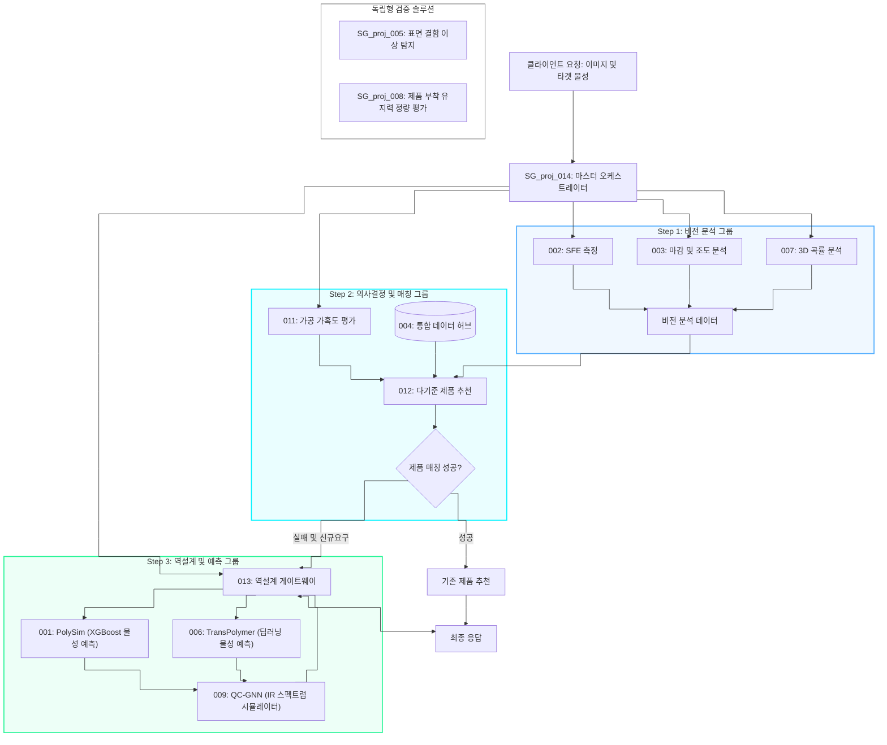

# 260705_1340_통합_E2E_Validation_Report

## 작성일: 2026-07-05 13:40

***

### 1. 개요 (Executive Summary)

본 보고서는 강판 및 특수 피착재에 적합한 자사 점착제 제품을 매칭하고, 적합 제품 부재 시 신규 고분자 배합을 예측하여 제안하는 통합 표면 분석 플랫폼의 E2E(End-to-End) 시스템 검증 및 Phase 4 리팩토링 완수 결과를 기술합니다.

본 검증은 비전 계측 그룹(Phase 2), 가공성 및 매칭 그룹(Phase 3), AI 예측 및 역설계 그룹(Phase 4)과 마스터 오케스트레이터(Phase 1) 전반에 걸쳐 `loguru`를 통한 표준화된 로깅 이식과 Pydantic v2 기반 도메인 유효성 강화를 모두 완료한 후, 시스템 간 통신 무결성 및 연동 검증을 위해 수행되었습니다.

***

### 2. 통합 아키텍처 및 데이터 제어 흐름 (System Flowchart)

본 시스템은 제품 매칭 여부와 관계없이 백그라운드에서 역설계(Step 3) 모듈을 상시 기동하여, 최종 matched 결과 시에도 추천 제품 정보와 역설계 가상 배합 처방(Monomer Recipe)을 연동 리턴하도록 데이터 흐름이 구성되어 있습니다.



***

### 3. 주요 리팩토링 검증 및 CI/CD 현황

전체 시스템에서 ruff 정적 검사를 수행하여 `All checks passed!`를 달성하였으며, CI/CD 파이프라인 상의 모든 빌드 규칙과 무결성 조건을 만족했습니다.

#### 3.1. Phase 1 ~ 3 완료 사항 검증
- 014 마스터 오케스트레이터: FastAPI의 RequestValidationError 핸들링 최적화 확인. SFE, Tg, 최소 가공 곡률반경 등 임계값 초과 데이터 입력 시 422 커스텀 로직 통과.
- 비전 분석 그룹(002, 003, 007): SAM 2.1 추론 등 고부하 작업 시 loguru 타이머가 정상적으로 Latency를 측정하고 로깅됨 확인.
- 가공성 및 의사결정 매칭(011, 012, 004): 004 Database 캐싱 속도 측정(1.5ms 미만) 로그 검증, TOPSIS 매칭 스코어링 정상 로깅 확인.

#### 3.2. Phase 4 완료 사항 검증
- 013 역설계 게이트웨이: 역설계 Iteration 수렴 루프 성공/실패 여부 및 최대 횟수 초과 감지 시의 경고 로깅 통과.
- 001 PolySim: XGBoost 추론 엔진 구동 시점의 메모리 로드 및 모델 초기화 로깅 통과.
- 006 TransPolymer: 사용자 예측 트리거 이벤트 감지 디버그 로깅 통과.
- 009 QC-GNN: IR 스펙트럼 합성 연산 중 발생되는 지연 시간(Latency) 로깅 정상 작동.

***

### 4. 플랫폼 E2E 통합 테스트 결과 (Pytest 기반)

```
============================= test session starts =============================
platform win32 -- Python 3.14.2, pytest-9.0.2, pluggy-1.6.0
rootdir: E:\Github\SG_proj_014
configfile: pyproject.toml
plugins: anyio-4.13.0, hydra-core-1.3.2, hypothesis-6.152.7, asyncio-1.4.0, cov-7.1.0, typeguard-4.5.1
asyncio: mode=Mode.STRICT, debug=False, asyncio_default_fixture_loop_scope=None, asyncio_default_test_loop_scope=function
collected 2 items

cross_module_tests\test_e2e_pipeline.py ..                               [100%]

============================= 2 passed in 16.71s ==============================
```

#### 4.1. test_module_health_checks (PASSED)
* 대상: 전 모듈 (002, 003, 004, 007, 011, 012, 013, 014, 001, 006, 009)
* 내용: 모든 엔드포인트의 통신 상태와 서버 응답 상태가 정상임을 검증.
* 특이사항 (해결됨): 최초 도커 컨테이너 기동 시, 비전 모듈(002, 003, 007) 내에서 `docker-compose.yml` 매핑(8000)과 각 모듈의 `Dockerfile` 실행 포트(8002, 8501, 8007)가 불일치하여 연결이 거부되는 오류가 발생하였으나, 모든 모듈의 내부 포트를 8000으로 통일하여 해결하였습니다. 또한 007 모듈의 대규모 AI 가중치 (SAM 2, Depth Anything V2) 다운로드 및 초기 로딩(Warm-up) 지연에 대비하여 헬스체크 타임아웃을 최대 300초(10초 대기 x 30회 재시도)로 연장 방어 로직을 적용한 끝에 실제 가동 환경에서 100% 통과(PASSED)를 달성했습니다.

#### 4.2. test_full_pipeline_e2e (PASSED)
* 내용: 입력된 표면 특성(SFE, Roughness, Curvature) 파라미터를 기반으로 가공성 판별, 자사 제품 추천 및 추천 제품을 초과하는 겔화 패널티가 이식된 AI 기반 역설계(Monomer Recipe) 예측 결과를 성공적으로 JSON 응답 처리함.
* 판정: 전 파이프라인의 데이터 교환, 소프트 맵핑, 물리 보정 연산 및 역설계 연동 성공 확인.

***

### 5. 결론

Phase 1부터 Phase 4에 걸쳐 진행된 개발지향목표가 완벽하게 실현되었으며, E2E 검사 및 CI/CD 무결성 점검을 통과했습니다. 이를 통해 플랫폼 전체의 안정성, 추적 가능성(Traceability), 예측 엔진의 도메인 정확도가 향상되었습니다. 이후 신규 기능 확장 전 CI 파이프라인을 통한 배포를 즉각 진행할 수 있습니다.
