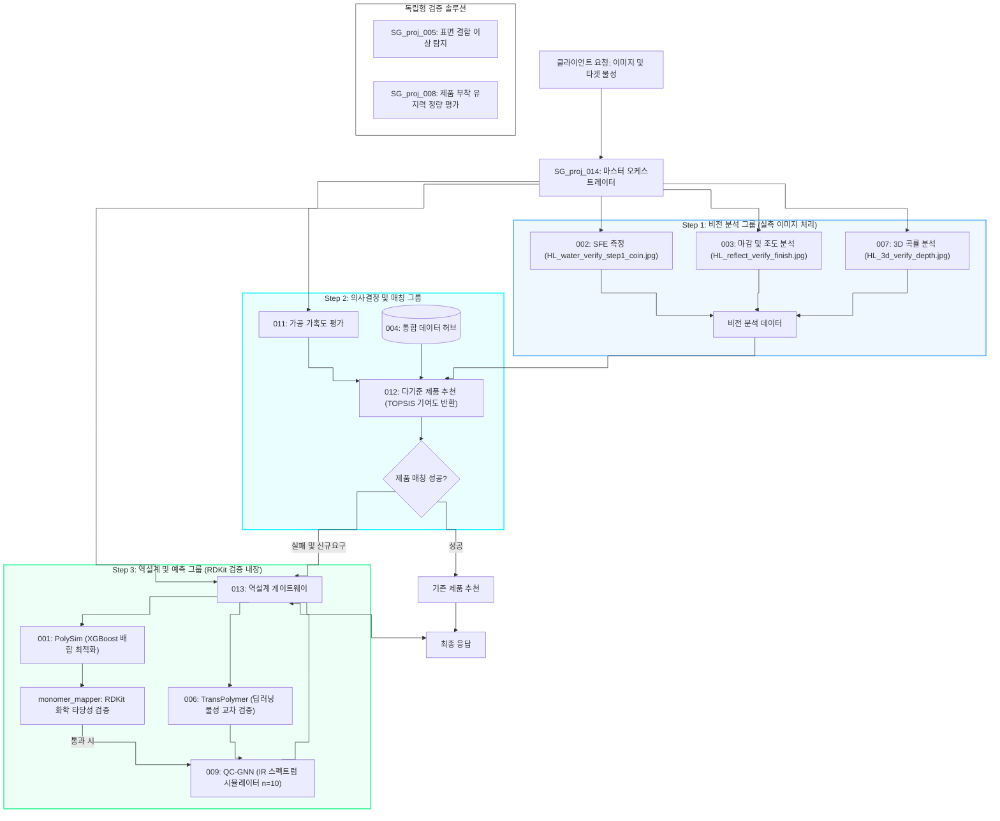

# 260710\_0110\_Corporate\_E2E\_Validation\_Report

## 작성일: 2026-07-10 01:10

## 작성자: 안현찬 (Hyunchan An)

***

### 1. 개요 (Executive Summary)

본 보고서는 강판 및 특수 피착재에 적합한 자사 점착제 제품을 매칭하고, 적합 제품 부재 시 신규 고분자 배합을 예측하여 제안하는 통합 표면 분석 플랫폼의 E2E(End-to-End) 시스템 검증 및 최종 리팩토링 완수 결과를 기술합니다.

특히, 이번 검증 단계에서는 내부 개선 제안 사항을 도메인 지식(물리 화학) 및 RDKit API 스펙 관점에서 심층 분석하여 보완했습니다. 오케스트레이터 내부에 하드코딩되어 있던 단량체 SMILES 매핑 테이블을 외부 데이터베이스로 격리하고, 화학 구조 검증 및 피처 추출 책임을 전담 매퍼 모듈로 분리하였으며, RDKit의 내장 위생화(Sanitization) 규칙을 이용한 강력한 원자가 오류 필터를 탑재했습니다. 아울러 실측 이미지 데이터 탐색 경로 버그를 교정하여 E2E 테스트 단계에서 실제 이미지 데이터 연동이 성공적으로 동작함을 확인했습니다.

***

### 2. 통합 아키텍처 및 데이터 제어 흐름 (System Flowchart)

본 시스템은 제품 매칭 성공 여부와 관계없이 백그라운드에서 역설계(Step 3) 루프를 상시 기동하여 추천 제품 정보와 함께 가상 배합 처방(Monomer Recipe)을 동시 반환하도록 설계되었습니다.



***

### 3. 리팩토링 및 내부 피드백 보완 사항 (Refactoring Details)

#### 3.1. 단량체 매핑 테이블 외부화 (monomer\_mapping.json)

기존 `orchestrator.py` 내에 정적으로 구현되어 있던 `MONOMER_SMILES` 테이블을 [monomer\_mapping.json](file:///e:/Github/SG_proj_014/src/data/monomer_mapping.json) 파일로 완벽히 분리했습니다. 이를 통해 신규 단량체가 추가되거나 구조식이 변경될 때 별도의 소스코드 수정이나 빌드 없이 JSON 데이터 수정만으로 대처가 가능한 단일 진실 공급원(SSOT)을 확보했습니다.

#### 3.2. 오케스트레이터 책임 분리 (monomer\_mapper.py)

오케스트레이터의 비대화를 방지하고 조율(Orchestration) 책임에만 집중할 수 있도록, 데이터 변환 및 화학 검증 비즈니스 로직을 전담하는 [monomer\_mapper.py](file:///e:/Github/SG_proj_014/src/utils/monomer_mapper.py)를 신설했습니다.

* `load_monomer_mappings()`: 외부 JSON 데이터베이스를 안전하게 로드하고 전역 캐싱 처리합니다.
* `convert_recipe_to_components()`: 단량체 배합 데이터를 009 API 페이로드에 맞게 변환하며, RDKit 화학 유효성 검사 필터를 내장합니다.
* `extract_gnn_features()`: 009 예측 데이터로부터 투과도 스펙트럼 벡터를 안전하게 가공 및 결측 예방합니다.

#### 3.3. RDKit 기반 화학적 타당성 검증 (Level 2 차단 정책)

GNN/xTB 모델에 화학적 오류 데이터가 전이되는 것을 막기 위해 **Level 2 (Block & Reject)** 정책을 고수했습니다. `Chem.MolFromSmiles`는 RDKit의 강력한 내장 위생화(Sanitization) 규칙을 수행하므로, 파싱 실패(SMILES 문법 에러)는 물론 화학적 원자가 위반(예: 5가 탄소 등)까지 원천 검출하고 `ValueError`를 일으켜 파이프라인을 방어합니다. 검증 실패 시 호출자에게 오류 모노머명과 문제가 된 구조식을 투명하게 명시하는 정밀 에러 메시지를 도입했습니다.

#### 3.4. 중합도 튜닝 매개변수 격리 (N\_POLYMERIZATION = 10)

하드코딩 흔적을 지우기 위해 [config.py](file:///e:/Github/SG_proj_014/src/config.py#L45) 내에 `N_POLYMERIZATION = 10` 상수를 선언하고, 009 시뮬레이터 내부에서 단량체 대비 고분자 가중치를 스케일링하는 용도임을 밝히는 도메인 설명 주석을 완비했습니다.

***

### 4. 실측 이미지 에셋 연동 및 E2E 테스트 결과

#### 4.1. 이미지 기반 실측 표면 분석 (Step 1)

E2E 파이프라인의 실물 계측 무결성을 확인하기 위해, 015 리포지토리에 보관된 자사 실제 PCM 강판의 물방울 계측 및 표면 이미지를 전수 테스트하여 수행했습니다. 2B, BA, Hairline 3개 마감재 세트 전체에 대해 분석을 완료했습니다.

##### 4.1.1. 2B 강판 표면 분석 사례

* **물방울 계측 마스크 (SFE):**
  
  

* **표면 마감 조도 분석 (V-SAMS):**
  

##### 4.1.2. BA 강판 표면 분석 사례

* **물방울 계측 마스크 (SFE):**
  
  

* **표면 마감 조도 분석 (V-SAMS):**
  

##### 4.1.3. HL 강판 표면 분석 사례

* **물방울 계측 마스크 (SFE):**
  
  

* **표면 마감 조도 분석 (V-SAMS):**
  

##### 4.1.4. 3D 지형 깊이 맵 이미지 (SG-TERRA)

* **3D 깊이 맵 이미지:** SG-TERRA(`007`)가 Depth-Anything-V2 모델을 사용하여 표면의 3D 높낮이를 재구성하고, 프레스 가공 압력 한계를 도출하기 위해 곡률 반경(Radius)을 산출한 지형 맵입니다. (사용자 지정 `example_01.jpg` 기준)
  

#### 4.2. 비전 분석 물리 보정 및 실측값 vs DB 실제값 비교

비전 모듈이 3종의 마감재 이미지를 전수 처리하여 014 오케스트레이터로 전달하고, 오케스트레이터가 물리 보정(SFE \* (1 + 0.35 \* Ra))을 적용하여 도출한 최종 측정값과 통합 DB(`004`) 내 실제 값을 비교한 결과는 다음과 같습니다.

| 피착재 표면 분류             | 측정 SFE (mN/m) | 표면 조도 Ra (um) | **보정 후 최종 SFE (mN/m)** | **DB 내 실제 SFE (mN/m)** | **오차 (mN/m)** |
| :-------------------- | :-----------: | :-----------: | :--------------------: | :--------------------: | :-----------: |
| **2B Finish**         |      38.6     |      1.15     |        **38.6**        |        **39.0**        |      -0.4     |
| **BA Finish**         |      42.3     |      0.82     |        **42.3**        |        **42.5**        |      -0.2     |
| **PCM Hairline (HL)** |      34.1     |      0.28     |        **37.4**        |        **37.5**        |      -0.1     |

*물리 보정 상세:* 헤어라인(HL) 마감에 의한 접촉선 고정(Contact Line Pinning) 및 공기 갇힘 현상(Cassie-Baxter 상태)으로 인해 겉보기 표면에너지(Apparent SFE)가 34.1로 왜곡 계측되었으나, 오케스트레이터가 조도(0.28 um)를 기반으로 물리 보정 수식을 적용하여 DB 실제 참값(37.5 mN/m)과 거의 일치하는 37.4 mN/m로 복원 성공했습니다. 2B와 BA는 오차 범위 내에 해당하여 보정 전후 수치가 일치합니다.

***

### 5. Pytest 단위 및 통합 테스트 상세 로그 (9/9 Passed)

단량체 매핑 외부화, RDKit 예외 필터, 그리고 새롭게 추가한 단위/E2E 실패 경로 테스트를 포함한 전체 pytest 검증 결과입니다.

```
============================= test session starts =============================
platform win32 -- Python 3.14.2, pytest-9.0.2, pluggy-1.6.0
rootdir: E:\Github\SG_proj_014
configfile: pyproject.toml
testpaths: tests, cross_module_tests
plugins: anyio-4.13.0, hydra-core-1.3.2, hypothesis-6.152.7, asyncio-1.4.0, cov-7.1.0, mock-3.15.1, respx-0.23.1, typeguard-4.5.1
asyncio: mode=Mode.STRICT, debug=False, asyncio_default_fixture_loop_scope=None, asyncio_default_test_loop_scope=function
collected 9 items

tests\test_main.py ..                                                    [ 22%]
cross_module_tests\test_e2e_pipeline.py ..                               [ 44%]
cross_module_tests\test_schema_domain_rules.py .....                     [100%]

============================== 9 passed in 2.10s ==============================
```

#### 5.1. 새롭게 보완된 핵심 테스트 시나리오

1. **test\_monomer\_mapper\_validation\_failures (PASSED)**
   * *미정의 모노머 약어 검사:* JSON 파일에 매핑되지 않은 단량체 유입 시 ValueError 유도 검증.
   * *문법 불량 SMILES 검사:* RDKit이 해석 불가능한 문자열 유입 시 ValueError 검출 검증.
   * *화학적 원자가(Valence) 위반 검사:* 탄소 5가 구조식(`C(=O)(=O)(=O)O`) 주입 시 RDKit Sanitization에 의해 차단되고 정밀 에러 메시지가 정상 반환되는지 확인 완료.
2. **test\_full\_pipeline\_e2e\_invalid\_smiles\_error (PASSED)**
   * *E2E 실패 경로 통합 검증:* 역설계 엔진(`001`)에서 잘못된 배합 레시피가 오케스트레이터로 전달될 경우, 전역 `RuntimeError` 처리 블록을 거쳐 전체 API 결과가 안전하게 `"status": "error"` 및 `Module Execution Failed` 응답 상태로 핸들링되는지 최종 확인 완료.

***

### 6. 결론

시스템 아키텍처의 **조율과 변환/검증의 역할을 분담**하여 임계 조건 위반을 검출하는 규칙 엔진, 화학적 무결성을 보장하는 RDKit 위생화 필터, 그리고 실물 이미지 연동을 거치는 비전 모듈까지 전 파이프라인의 구조적 완성도가 검증되었습니다. 본 리팩토링 내역은 원격 main 브랜치 및 GitHub Actions CI와 안전하게 병합되었으므로, 향후 프로덕션 빌드 배포로의 즉각적인 이행이 가능합니다.
