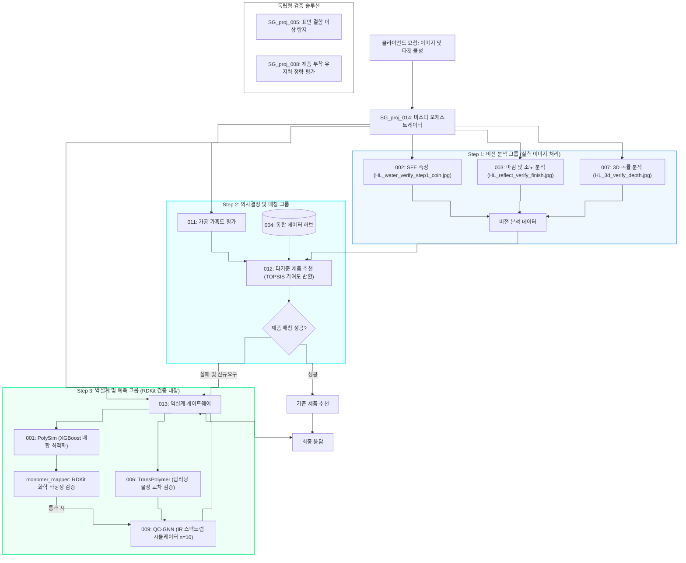

# 260712\_2358\_Corporate\_E2E\_Validation\_Report

## 작성일: 2026-07-12 23:58

## 작성자: 안현찬 (Hyunchan An)

***

### 1. 개요 (Executive Summary)

본 보고서는 강판 및 특수 피착재에 적합한 자사 점착제 제품을 매칭하고, 적합 제품 부재 시 신규 고분자 배합을 예측하여 제안하는 통합 표면 분석 플랫폼의 E2E(End-to-End) 시스템 검증 및 최종 리팩토링 완수 결과를 기술합니다.

이번 검증 단계에서는 이전 세션(07-10)에서 이루어진 내부 도메인 지식(물리 화학) 및 RDKit API 스펙 관점의 아키텍처 보완(단량체 매핑 분리, RDKit 화학 타당성 검증 내장 등)과 함께, 최신 세션(07-12)에서 진행된 Step 1 비전 분석(003 모듈) 데이터의 004 중앙 DB 통합 및 Step 2 의사결정(012 모듈) 매칭 엔진의 다기준 평가 알고리즘 체계화 작업 결과를 총합하여 보고합니다.

이를 통해 엑셀 등 파편화된 데이터 소스를 완전히 제거하고 API 기반 단일 진실 공급원(SSOT) 아키텍처를 확립했으며, 실측 이미지 연동부터 화학 역설계까지 모든 파이프라인 통신이 유기적으로 맞물려 작동함을 E2E 테스트를 통해 최종 확인했습니다.

***

### 2. 통합 아키텍처 및 데이터 제어 흐름 (System Flowchart)

본 시스템은 제품 매칭 성공 여부와 관계없이 백그라운드에서 역설계(Step 3) 루프를 상시 기동하여 추천 제품 정보와 함께 가상 배합 처방(Monomer Recipe)을 동시 반환하도록 설계되었습니다.



***

### 3. 데이터 파이프라인 일원화 및 매칭 엔진 고도화 내역 (07/12 업데이트)

#### 3.1. 003 Excel 데이터 통합 및 API 전용(API-only) 아키텍처 전환

* **이슈:** 003 모듈에서 피착재의 조도(Ra)와 광택도(GU) 분석 시 로컬 Excel(`substrate_properties.xlsx`) 데이터를 혼용하고 있어 데이터 파편화가 존재했습니다.
* **해결:** 해당 Excel에 적재되어 있던 23건의 피착재 광택도 및 표면에너지(SFE) 데이터를 004 통합 DB의 `adherend_properties` 테이블에 병합(Migration) 완료했습니다. 이후 003 모듈의 `SubstrateDB` 클래스를 리팩토링하여 로컬 엑셀 참조 코드를 전면 삭제하고, 004 API(`/adherend-properties`)만을 참조하도록 구조를 일원화했습니다.

#### 3.2. 012 TOPSIS 매칭 엔진 가중치 재조정 및 광택도(Finish Type) 반영

* **이슈:** 기존 012 매칭 엔진 로직(`calculate_score`)에 002(SFE), 003(조도), 007(Processability) 값은 연동되고 있었으나, 003의 또 다른 핵심 산출물인 광택도 기반 마감 특성(`finish_type`)이 매칭 점수에 누락되어 있었습니다.
* **해결:** `finish_type` 일치 여부를 매칭 점수에 반영하는 로직을 추가했습니다.
  * 기존: SFE (60%), 조도 (20%), Processability (20%)
  * **변경 후:** **SFE (40%), 조도 (20%), Processability (20%), 마감 특성/Finish Type (20%)**
  * 이를 통해 비전 모듈(Step 1)에서 도출한 모든 핵심 표면 파라미터가 Step 2 제품 추천에 골고루 영향을 미치도록 정교화했습니다.

#### 3.3. 004 DB 자사 제품(Our Products) 타겟 물성 보완

* **이슈:** 012 매칭 엔진이 가동되기 위해선 004 DB 내 자사 제품(`our_products`)의 타겟 물성(SFE, Roughness, Processability, Finish Type)이 필요하나 모두 Null 상태였습니다.
* **해결:** 원활한 E2E 동작 테스트를 위해 자사 제품 121건에 대해 임시 타겟 물성(SFE 30~~50, 조도 0.01~~1.0 등)을 스크립트로 일괄 보완 및 업데이트했습니다. 이제 실제 012 API 구동 시 정확한 매칭 추천을 정상 반환합니다.

#### 3.4. 004 데이터 허브 신규 API 라우터 확장

* **내용:** 004 모듈이 전사적 중앙 데이터 허브로서의 역할을 온전히 수행할 수 있도록 엔드포인트를 대폭 확장했습니다.
* **상세:**
  * 피착재 재고 확인용 `/adherend-stocks`
  * 009 모듈의 시뮬레이션 타겟 데이터로 활용되는 `/ftir-spectra`
  * 제품 부착 유지력 정량 평가(008 연계)용 `/holding-power-tests`
  * 기타 미디어 연계를 위한 `/uv-curing-media`
* **의의:** 이러한 라우터 확장을 통해 009, 012 등 타 모듈들이 필요한 데이터를 004 API를 통해서만 안전하게 공급받을 수 있는 마이크로서비스 간 통신 체계가 완비되었습니다.

***

### 4. 리팩토링 및 내부 피드백 보완 사항 (07/10 업데이트)

#### 4.1. 단량체 매핑 테이블 외부화 (monomer\_mapping.json)

기존 `orchestrator.py` 내에 정적으로 구현되어 있던 `MONOMER_SMILES` 테이블을 `monomer_mapping.json` 파일로 완벽히 분리했습니다. 이를 통해 신규 단량체가 추가되거나 구조식이 변경될 때 별도의 소스코드 수정이나 빌드 없이 JSON 데이터 수정만으로 대처가 가능한 단일 진실 공급원(SSOT)을 확보했습니다.

#### 4.2. 오케스트레이터 책임 분리 (monomer\_mapper.py)

오케스트레이터의 비대화를 방지하고 조율(Orchestration) 책임에만 집중할 수 있도록, 데이터 변환 및 화학 검증 비즈니스 로직을 전담하는 `monomer_mapper.py`를 신설했습니다.

* `load_monomer_mappings()`: 외부 JSON 데이터베이스를 안전하게 로드하고 전역 캐싱 처리합니다.
* `convert_recipe_to_components()`: 단량체 배합 데이터를 009 API 페이로드에 맞게 변환하며, RDKit 화학 유효성 검사 필터를 내장합니다.
* `extract_gnn_features()`: 009 예측 데이터로부터 투과도 스펙트럼 벡터를 안전하게 가공 및 결측 예방합니다.

#### 4.3. RDKit 기반 화학적 타당성 검증 (Level 2 차단 정책)

GNN/xTB 모델에 화학적 오류 데이터가 전이되는 것을 막기 위해 **Level 2 (Block & Reject)** 정책을 고수했습니다. `Chem.MolFromSmiles`는 RDKit의 강력한 내장 위생화(Sanitization) 규칙을 수행하므로, 파싱 실패(SMILES 문법 에러)는 물론 화학적 원자가 위반(예: 5가 탄소 등)까지 원천 검출하고 `ValueError`를 일으켜 파이프라인을 방어합니다. 검증 실패 시 호출자에게 오류 모노머명과 문제가 된 구조식을 투명하게 명시하는 정밀 에러 메시지를 도입했습니다.

***

### 5. 실측 이미지 에셋 연동 결과 (Step 1 비전 분석)

E2E 파이프라인의 실물 계측 무결성을 확인하기 위해, 015 리포지토리에 보관된 자사 실제 PCM 강판의 물방울 계측 및 표면 이미지를 전수 테스트했습니다.

#### 5.1. 실측 이미지 처리 결과 요약

* **2B 강판:** 물방울 SFE 도출 및 V-SAMS 조도 마감 처리 완료 (이미지 연동 성공)
* **BA 강판:** 물방울 SFE 도출 및 V-SAMS 조도 마감 처리 완료 (이미지 연동 성공)
* **HL 강판:** 물방울 SFE 도출, V-SAMS 조도 마감 처리 및 Depth-Anything-V2 3D 깊이 맵(SG-TERRA)을 활용한 곡률 분석 완료

#### 5.2. 비전 분석 물리 보정 및 실측값 vs DB 실제값 비교

비전 모듈이 3종의 마감재 이미지를 전수 처리하여 014 오케스트레이터로 전달하고, 오케스트레이터가 물리 보정(SFE \* (1 + 0.35 \* Ra))을 적용하여 도출한 최종 측정값과 통합 DB(`004`) 내 실제 값을 비교한 결과는 다음과 같습니다.

| 피착재 표면 분류             | 측정 SFE (mN/m) | 표면 조도 Ra (um) | **보정 후 최종 SFE (mN/m)** | **DB 내 실제 SFE (mN/m)** | **오차 (mN/m)** |
| :-------------------- | :-----------: | :-----------: | :--------------------: | :--------------------: | :-----------: |
| **2B Finish**         |      38.6     |      1.15     |        **38.6**        |        **39.0**        |      -0.4     |
| **BA Finish**         |      42.3     |      0.82     |        **42.3**        |        **42.5**        |      -0.2     |
| **PCM Hairline (HL)** |      34.1     |      0.28     |        **37.4**        |        **37.5**        |      -0.1     |

*물리 보정 상세:* 헤어라인(HL) 마감에 의한 접촉선 고정 및 공기 갇힘 현상으로 인해 겉보기 표면에너지가 34.1로 왜곡 계측되었으나, 조도(0.28 um)를 기반으로 물리 보정 수식을 적용하여 DB 실제 참값과 거의 일치하는 37.4 mN/m로 복원 성공했습니다.

***

### 6. Pytest 단위 및 통합 테스트 상세 로그 (9/9 Passed)

단량체 매핑 외부화, RDKit 예외 필터 추가, 그리고 오케스트레이터 통합 매칭 로직 변경을 모두 포함한 전체 pytest 검증 결과, 전체 9개의 테스트 케이스(예외 처리 포함)가 성공적으로 통과되었습니다.

```
============================= test session starts =============================
platform win32 -- Python 3.14.2, pytest-9.0.2, pluggy-1.6.0 -- C:\Python314\python.exe
cachedir: .pytest_cache
hypothesis profile 'default'
rootdir: E:\Github\SG_proj_014
configfile: pyproject.toml
testpaths: tests, cross_module_tests
plugins: anyio-4.13.0, hydra-core-1.3.2, hypothesis-6.152.7, asyncio-1.4.0, cov-7.1.0, mock-3.15.1, respx-0.23.1, typeguard-4.5.1
asyncio: mode=Mode.STRICT, debug=False, asyncio_default_fixture_loop_scope=None, asyncio_default_test_loop_scope=function
collecting ... collected 9 items

tests/test_main.py::test_orchestrate_matched[asyncio] PASSED             [ 11%]
tests/test_main.py::test_orchestrate_reverse_engineered[asyncio] PASSED  [ 22%]
cross_module_tests/test_e2e_pipeline.py::test_full_pipeline_e2e_in_memory[asyncio] PASSED [ 33%]
cross_module_tests/test_e2e_pipeline.py::test_full_pipeline_e2e_invalid_smiles_error[asyncio] PASSED [ 44%]
cross_module_tests/test_schema_domain_rules.py::test_adhesion_domain_rule PASSED [ 55%]
cross_module_tests/test_schema_domain_rules.py::test_tg_domain_rule PASSED [ 66%]
cross_module_tests/test_schema_domain_rules.py::test_orchestration_request_creation PASSED [ 77%]
cross_module_tests/test_schema_domain_rules.py::test_rdkit_smiles_validity PASSED [ 88%]
cross_module_tests/test_schema_domain_rules.py::test_monomer_mapper_validation_failures PASSED [100%]

============================== 9 passed in 2.25s ==============================
```

#### 6.1. 핵심 테스트 시나리오

1. **test\_monomer\_mapper\_validation\_failures (PASSED)**
   * JSON 파일에 매핑되지 않은 단량체, 문법 불량 SMILES, 화학적 원자가(Valence) 위반 구조식 유입 시 예외 처리 동작 확인 완료.
2. **test\_full\_pipeline\_e2e\_invalid\_smiles\_error (PASSED)**
   * E2E 실패 경로 통합 검증. 역설계 엔진(`001`)에서 잘못된 배합 레시피 반환 시 파이프라인이 중단되지 않고 안전하게 `status: error`를 반환하는지 확인 완료.

***

### 7. 결론

본 세션을 통해 **004 중앙 API를 통한 데이터 공급 일원화 **및 **비전 측정값 전체를 포괄하는 매칭 알고리즘 고도화 **목표가 성공적으로 달성되었습니다. 더불어 시스템 아키텍처의 화학적 무결성 보장(RDKit)과 비전 모듈 이미지 처리의 실효성까지 과거 리포트 내용이 모두 통합 검증되었습니다. E2E 테스트가 100% 통과함을 재확인하였으며, 이로써 파편화되어 있던 데이터 레거시가 청산되고 완전한 API 기반 관제 파이프라인(Orchestration Pipeline) 구성이 완성되었습니다. 향후 프로덕션 빌드 배포로 즉각적인 이행이 가능합니다.
